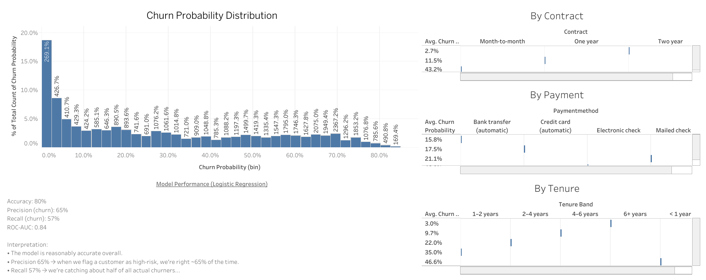

## Customer Churn Analytics (Telecom)

End-to-end customer churn project combining **Python (ML)** and **Tableau (BI)**.

Goal:  
Predict which telecom customers are likely to churn and translate the model into **simple business actions** for the retention team.

---

## 1. Project Overview 

This project answers three main questions:

1. **Who is most likely to churn?**
2. **What are the key drivers of churn?**
3. **How can the business act on these insights?**

I trained a **logistic regression model** on a public telco churn dataset, scored customers with churn probabilities, and visualized key patterns in a Tableau dashboard.

---

## 2. Tech Stack

- **Language:** Python 3
- **Libraries:** pandas, numpy, scikit-learn, joblib
- **ML Model:** Logistic Regression
- **Visualization:** Tableau Public (and/or Excel)
- **Version control:** Git + GitHub

---

## 3. Project Structure

```
customer-churn-analytics/
├─ data/
│  ├─ raw/
│  │  └─ telco_churn_raw.csv          # Original telco churn dataset
│  └─ processed/
│     └─ churn_scored.csv             # Test set with churn probabilities
├─ docs/
│  ├─ churn_report.md                 # Business/BA-style report
│  └─ churn_dashboard.png             # Exported Tableau dashboard (optional)
├─ models/
│  └─ churn_logistic_model.pkl        # Saved logistic regression model
├─ notebooks/
│  └─ 01_churn_model.ipynb            # Main Jupyter notebook (EDA + ML)
├─ .gitignore
└─ README.md
If your filenames differ slightly, that’s fine—just tweak the paths above.
```
---

## 4. Data
Source: Public telco customer churn dataset (e.g., Kaggle).
Each row = one customer, with fields like:

Customer info: customerID, gender, senior citizen, dependents

Services: phone service, internet service, streaming, tech support, etc.

Account: contract type, payment method, paperless billing, tenure, charges

Target: Churn (Yes/No)

After cleaning:

Total rows: ~7,043 customers

Churn rate: ~26–27% of customers

---

## 5. Modeling Steps (Notebook: 01_churn_model.ipynb)
5.1. Preprocessing
Loaded the raw CSV:

python
Copy code
df = pd.read_csv("data/raw/telco_churn_raw.csv")
Cleaned / prepared:

Standardized column names (lowercase, underscores).

Converted TotalCharges to numeric and dropped rows with bad/missing values.

Encoded Churn as:

Yes → 1 (churner)

No → 0 (non-churner)

One-hot encoded categorical features with pd.get_dummies(drop_first=True).

Train–test split:

python
Copy code
X_train, X_test, y_train, y_test = train_test_split(
    X, y,
    test_size=0.2,
    random_state=42,
    stratify=y
)
5.2. Model
Algorithm: Logistic Regression (sklearn.linear_model.LogisticRegression)

Parameters: max_iter=1000

Evaluation metrics on the test set:

Accuracy: ~80%

Class 1 (Churn)

Precision ≈ 65%

Recall ≈ 57%

F1-score ≈ 0.61

ROC-AUC: ~0.84

These numbers mean the model is reasonably strong at separating churners from non-churners.

---

## 6. Feature Importance (Key Drivers)
From the logistic regression coefficients and follow-up analysis:

Tenure

Shorter tenure → higher churn risk

Long-tenure customers are much more stable.

Contract Type

Month-to-month contracts have significantly higher churn probability.

1-year and 2-year contracts show much lower churn.

Charges

Higher MonthlyCharges are associated with higher churn risk.

Payment Method

Certain payment methods (e.g., electronic check) show higher churn than others (e.g., bank transfer, credit card).

These drivers are visualized in Tableau.

---

## 7. Scored Dataset
I exported model scores for the test set:

python
Copy code
X_test_copy = X_test.copy()
X_test_copy["churn_actual"] = y_test.values
X_test_copy["churn_probability"] = y_prob
X_test_copy.to_csv("data/processed/churn_scored.csv", index=False)
data/processed/churn_scored.csv is used as the input to Tableau.

Columns include:

churn_actual (0/1)

churn_probability (0–1)

plus the original features for each customer in the test set.

## 8. Tableau Dashboard
Dashboard views (built on churn_scored.csv):

Churn Probability Distribution

Histogram of predicted churn probability.

Shows most customers are low-risk, with a smaller tail of high-risk customers.

Average Churn Probability by Contract

Month-to-month vs 1-year vs 2-year.

Month-to-month customers have the highest churn risk.

Average Churn Probability by Tenure Band

< 1 year, 1–2 years, 2–4 years, 4–6 years, 6+ years.

Short-tenure customers are much more likely to churn.

Average Churn Probability by Payment Method

Electronic check vs credit card vs bank transfer vs mailed check.

Highlights riskier payment channels.

Optional: exported as docs/churn_dashboard.png and referenced below.

## Dashboard Preview

Below is a preview of the Tableau churn dashboard built from the scored dataset:



---

## 9. How to Run Locally
Clone the repo

bash
Copy code
git clone <your-repo-url>.git
cd customer-churn-analytics
Create & activate a virtual environment (optional but recommended)

bash
Copy code
# Windows (PowerShell)
python -m venv .venv
.venv\Scripts\activate

# macOS/Linux
python -m venv .venv
source .venv/bin/activate
Install dependencies

bash
Copy code
pip install -r requirements.txt  # if you create one
Run the notebook

bash
Copy code
jupyter notebook notebooks/01_churn_model.ipynb
Open Tableau

Connect to data/processed/churn_scored.csv.

Recreate or refresh the dashboard.

---

## 10. Business Takeaways (Summary)
The model can reliably rank customers by churn risk (ROC-AUC ≈ 0.84).

Churn is concentrated among:

Short-tenure, month-to-month customers,

With higher monthly charges, and

Certain payment methods (e.g., electronic check).

Targeted retention programs focused on these segments can reduce churn and protect recurring revenue.

---

For a more narrative, BA-style explanation, see:
👉 docs/churn_report.md
